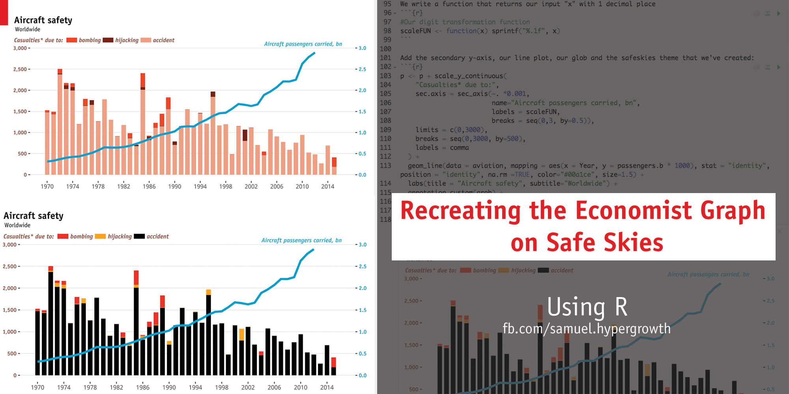

# Recreating an Economist graph from scratch using ggplot
This is a weekend exercise. Our objective is to reproduce an Economist graph found on the article: [Safe Skies](http://www.economist.com/blogs/graphicdetail/2014/03/daily-chart-6). The Economist article came in light of the MH370 incident, and argued that despite the recent tragedy, air flights are getting safer. 

# The Challenge
Because we are reproducing a graph from scratch, this project involves the collection of data from the original sources. However, since the primary objective of this exercise is concerned with the use of ggplot2 and the various techniques in generating an Economist-like graph, I have compiled the data into a dataset, `aviation.csv`, which is included in the repo. Our approach in recreating the Economist graph will be as follow:

1. Read and process the dataset 
2. Load the 'ITC Officina' fonts installed on our system `showtext` library
3. Create a ggplot2 theme, called `theme_safeskies`, that will be used for our graph
4. Create a `textGrob` using the `grid` library
5. Create a digit transformation function
6. Create the underlying barchart without applying the theme
7. We add (3), (4), (5) onto the barchart we created in (6) to produce an identical replication of the Economist graph

# Project structure
The project is completed using R notebook, and exported to both HTML and PDF. All three files (Rmd, HTML and PDF) along with the dataset I've prepared, `aviation.csv`, are available in this repo. At the end of the exercise, I have attempted to re-create the original graph from scratch using only the vanilla ggplot library (without the use of `ggthemes` or other theming library) and in the process showed how we can create a custom theme for our own projects.  
